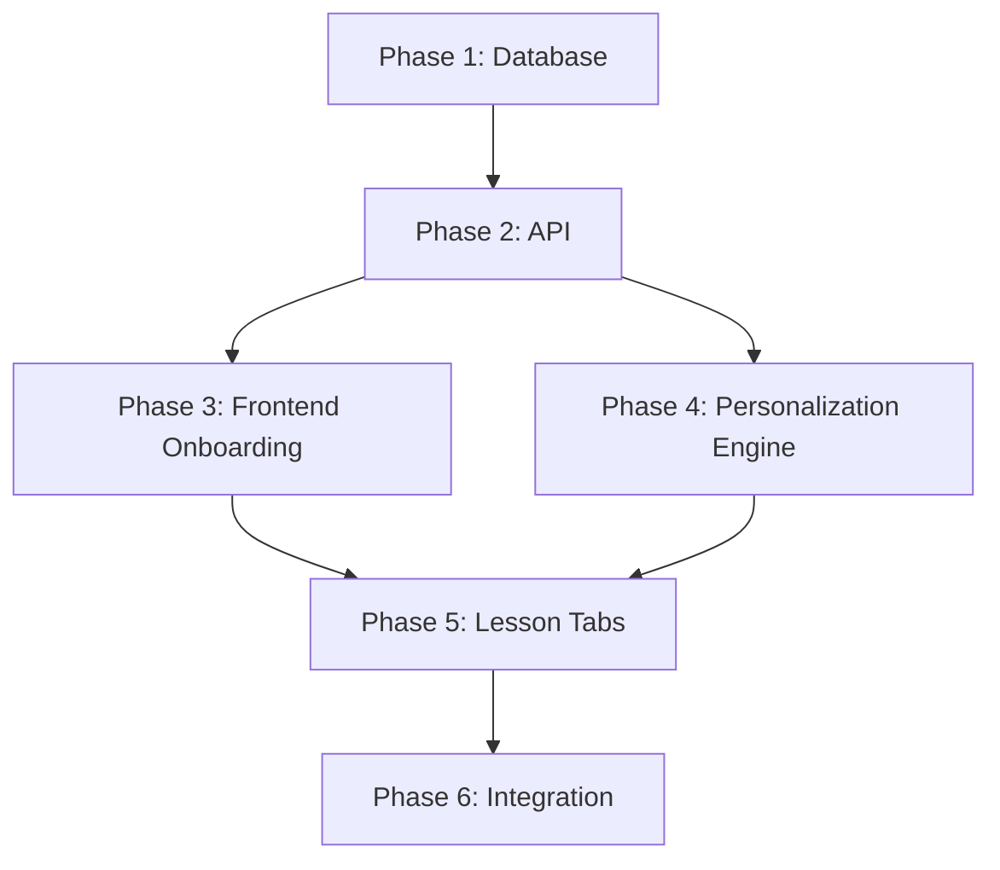
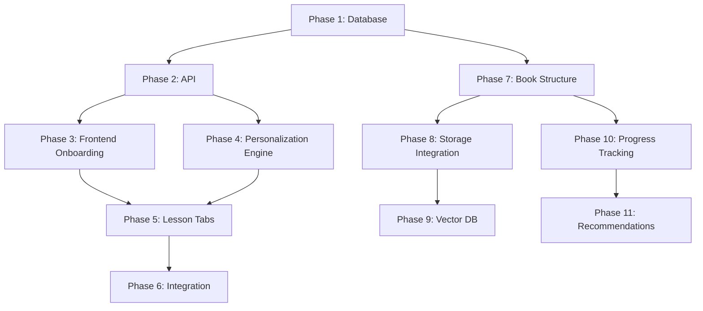

# Implementation Plan: Content Personalization

**Branch**: `005-content-personalization` | **Date**: 2025-11-30 | **Spec**: [spec.md](./spec.md)
**Input**: Feature specification from `/specs/005-content-personalization/spec.md`

## Summary

Add user personalization to the RoboGenesis AI Textbook with an onboarding questionnaire (6 questions), NeonDB persistence via SQLAlchemy async, and on-demand lesson content adaptation. Users see "Original | Personalized" tabs on lessons, with personalized content generated by an LLM agent based on their profile (education, programming experience, robotics background, AI/ML experience, goals, preferred language).

## Technical Context

**Language/Version**: Python 3.11+ (backend), TypeScript 5.3+ (frontend)
**Primary Dependencies**:
- Backend: FastAPI, SQLAlchemy 2.0 (async), Alembic, asyncpg, OpenAI Agents SDK
- Frontend: Docusaurus 3, React 18
**Storage**: NeonDB Serverless Postgres (via asyncpg driver)
**Testing**: pytest (backend), manual E2E (frontend)
**Target Platform**: Linux server (backend), Web browser (frontend)
**Project Type**: Web application (monorepo with backend + frontend)
**Performance Goals**:
- Personalization generation < 10 seconds
- Cached content load < 1 second
- 100 concurrent personalization requests
**Constraints**:
- Skip auth for MVP (use localStorage user_id)
- Single Python backend (extend chatkit-backend)
- Keep technical terms in English for Urdu translations
**Scale/Scope**: MVP targeting initial users, scalable architecture for future growth

## Constitution Check

*GATE: Must pass before Phase 0 research. Re-check after Phase 1 design.*

| Gate | Status | Notes |
|------|--------|-------|
| **III. Technical Stack** | ✅ PASS | FastAPI backend, Docusaurus frontend, NeonDB Postgres, OpenAI Agents SDK |
| **IV. Hardware Awareness** | ✅ N/A | No robotics hardware involved in personalization |
| **V. Safety Governance** | ✅ PASS | No motor/robot control; LLM outputs are content adaptation only |
| **VI. Student Language Protocol** | ✅ PASS | Urdu translation preserves technical terms in English |
| **X. Spec-First Development** | ✅ PASS | spec.md complete before plan.md |

**Constitution Compliance**: All gates pass. No violations requiring justification.

## Project Structure

### Documentation (this feature)

```text
specs/005-content-personalization/
├── plan.md              # This file
├── research.md          # Phase 0 output
├── data-model.md        # Phase 1 output
├── quickstart.md        # Phase 1 output
├── contracts/           # Phase 1 output (OpenAPI specs)
│   └── api.yaml
└── tasks.md             # Phase 2 output (/sp.tasks command)
```

### Source Code (repository root)

```text
packages/chatkit-backend/
├── src/chatkit_backend/
│   ├── db/                      # NEW: Database setup
│   │   ├── __init__.py
│   │   ├── database.py          # Async engine, session factory
│   │   └── models.py            # SQLAlchemy models (User, UserPreferences, Cache)
│   ├── routers/                 # NEW: API routers
│   │   ├── __init__.py
│   │   ├── user.py              # User management endpoints
│   │   ├── onboarding.py        # Onboarding endpoints
│   │   └── personalize.py       # Personalization endpoint
│   ├── agents/
│   │   ├── tutor.py             # Existing tutor agent
│   │   └── personalizer.py      # NEW: Personalization agent
│   └── main.py                  # Include new routers
├── alembic/                     # NEW: Database migrations
│   ├── env.py
│   └── versions/
└── alembic.ini                  # NEW: Alembic config

apps/docs/src/
├── context/                     # NEW: React context providers
│   └── UserContext.tsx          # User state management
├── components/
│   ├── ChatKit/                 # Existing ChatKit
│   ├── OnboardingQuestionnaire.tsx  # NEW: 6-question form
│   └── PersonalizedLesson/      # NEW: Lesson tabs component
│       ├── index.tsx
│       └── PersonalizedContent.tsx
├── pages/
│   └── onboarding.tsx           # NEW: Onboarding page
└── theme/
    └── Root.tsx                 # Add UserContext provider
```

**Structure Decision**: Extend existing monorepo structure. Backend in `packages/chatkit-backend/` (add db/, routers/ folders), frontend in `apps/docs/src/` (add context/, pages/, components).

## Complexity Tracking

> No violations - no entries needed.

## Architecture Decisions

### AD-001: Skip Auth for MVP
- **Decision**: Use localStorage user_id instead of BetterAuth
- **Rationale**: Faster MVP delivery; auth can be layered later
- **Trade-off**: No cross-device persistence, no account recovery

### AD-002: On-Demand Personalization with Caching
- **Decision**: Generate personalized content on first request, cache in database
- **Rationale**: Avoid pre-generating all combinations; balance freshness vs. performance
- **Trade-off**: First load slower (~10s), subsequent loads fast (<1s)

### AD-003: Single Backend Extension
- **Decision**: Extend chatkit-backend rather than separate service
- **Rationale**: Simpler deployment, shared LLM configuration
- **Trade-off**: Larger single service

### AD-004: SQLAlchemy 2.0 Async
- **Decision**: Use SQLAlchemy 2.0 with async/await and asyncpg
- **Rationale**: Native async support, Alembic migration ecosystem
- **Trade-off**: More verbose than ORM-less approach

## Implementation Phases

### Phase 1: Database Setup
1. Add SQLAlchemy, asyncpg, alembic to pyproject.toml
2. Create db/database.py with async engine and session
3. Create db/models.py with User, UserPreferences, PersonalizedContentCache
4. Configure alembic.ini and env.py for async
5. Create initial migration
6. Add DATABASE_URL to .env

### Phase 2: User & Onboarding API
1. Create routers/user.py with create/get endpoints
2. Create routers/onboarding.py with submit endpoint
3. Create routers/personalize.py with preferences CRUD
4. Include routers in main.py
5. Test endpoints with httpie/curl

### Phase 3: Frontend Onboarding
1. Create UserContext.tsx with localStorage management
2. Create OnboardingQuestionnaire.tsx with 6 questions
3. Create pages/onboarding.tsx
4. Update Root.tsx to include UserContext
5. Add redirect logic for new users

### Phase 4: Personalization Engine
1. Create agents/personalizer.py with adaptation prompt
2. Create personalize router with generate endpoint
3. Implement content hash caching logic
4. Add cache invalidation on preference change

### Phase 5: Lesson Tabs UI
1. Create PersonalizedLesson/index.tsx with tabs
2. Create PersonalizedContent.tsx with fetch logic
3. Register in MDXComponents
4. Add loading/error states

### Phase 6: Integration & Testing
1. End-to-end testing (new user → onboarding → personalized lesson)
2. Cache hit/miss testing
3. Urdu translation testing
4. Update constitution.md if needed

## Dependencies



## Risk Analysis

| Risk | Mitigation |
|------|------------|
| NeonDB cold start latency | Use connection pooling, keep-alive queries |
| LLM rate limits on personalization | Implement retry with backoff, caching reduces calls |
| Large lesson content exceeds context | Chunk content, summarize if needed |
| MCP storage server offline | Health checks, fallback to direct file access |
| MCP vector DB server offline | Graceful degradation, return empty results |
| Large content files | Streaming upload, chunked processing |

---

## Phase 7: Book Structure (US5)

**Goal**: Create hierarchical book structure tables and content API

### Database Schema

```
┌─────────────┐       ┌─────────────┐       ┌─────────────┐       ┌─────────────┐
│   books     │◄──────│   parts     │◄──────│  chapters   │◄──────│   lessons   │
├─────────────┤  1:N  ├─────────────┤  1:N  ├─────────────┤  1:N  ├─────────────┤
│ id (PK)     │       │ id (PK)     │       │ id (PK)     │       │ id (PK)     │
│ slug        │       │ book_id (FK)│       │ part_id (FK)│       │ chapter_id  │
│ title       │       │ number      │       │ number      │       │ number      │
│ description │       │ title       │       │ local_number│       │ title       │
│ version     │       │ layer       │       │ title       │       │ slug        │
└─────────────┘       │ tier        │       │ folder_name │       │ type        │
                      │ folder_name │       │ prerequisites│      │ content_hash│
                      │ week_start  │       └─────────────┘       │ bucket_path │
                      │ week_end    │                             │ vector_ids  │
                      └─────────────┘                             └─────────────┘
```

### Implementation Steps
1. Add Book, Part, Chapter, Lesson models to db/models.py
2. Create migration 002_book_structure.py
3. Create migration 003_seed_book_data.py (from curriculum.md)
4. Create content.py router with browse endpoints
5. Register router in main.py

---

## Phase 8: Storage Integration (US5)

**Goal**: Upload content to MCP storage bucket and serve via API

### MCP Storage Configuration

- **Server URL**: http://localhost:8001/sse
- **Bucket Alias**: `books_main`
- **Path Structure**: `books/{book_slug}/parts/{part_folder}/chapters/{chapter_folder}/lessons/{lesson_slug}.md`

### Implementation Steps
1. Create services/mcp_storage.py with MCPStorageClient
2. Create services/content_sync.py for syncing content
3. Add sync CLI command in cli.py
4. Implement GET /api/content/lessons/{slug}/content endpoint
5. Run initial sync to upload all content

---

## Phase 9: Vector DB Integration (US5)

**Goal**: Embed lesson content for RAG-enabled search

### MCP Vector DB Configuration

- **Server URL**: http://localhost:8002/sse
- **Chunking**: ~500 tokens (~2000 chars) with 100 token overlap
- **Split on**: Markdown headers (##, ###)

### Chunk Metadata Schema
```json
{
  "lesson_id": "uuid",
  "chapter_id": "uuid",
  "part_id": "uuid",
  "book_slug": "robo-genesis-ai",
  "chunk_index": 0,
  "section_title": "string"
}
```

### Implementation Steps
1. Create services/embeddings.py with chunking logic
2. Create services/mcp_vector.py with VectorDBClient
3. Add embedding generation to content sync
4. Implement POST /api/search endpoint for RAG queries
5. Store vector_ids in lessons table

---

## Phase 10: Progress Tracking (US6)

**Goal**: Track user progress through lessons

### UserProgress Table
```
┌─────────────────────┐
│   user_progress     │
├─────────────────────┤
│ id (PK)             │
│ user_id (FK→users)  │
│ lesson_id (FK)      │
│ status              │  'not_started' | 'in_progress' | 'completed'
│ started_at          │
│ completed_at        │
│ time_spent_seconds  │
└─────────────────────┘
```

### Implementation Steps
1. Add UserProgress model to db/models.py
2. Update User model with progress_entries relationship
3. Create migration 004_user_progress.py
4. Create progress.py router with CRUD endpoints
5. Implement progress summary calculations

---

## Phase 11: Recommendations (US7)

**Goal**: Provide personalized lesson recommendations

### Recommendation Algorithm
```
1. Get user's completed lessons
2. Find next sequential lessons in incomplete chapters
3. Check prerequisites (completed chapters required)
4. Factor in user_preferences:
   - learning_goals alignment
   - experience level (programming, AI/ML)
   - pedagogy layer progression (L1→L2→L3)
5. Score and rank candidates
6. Return top N with reasons
```

### Implementation Steps
1. Create services/recommendations.py with ranking logic
2. Implement GET /api/progress/recommendations endpoint
3. Add prerequisite validation
4. Add learning goals alignment scoring

---

## Updated Dependencies



**Critical Path for Book Structure**:
- Phase 7 (Book Structure) must complete before Phases 8, 9, 10
- Phase 10 (Progress) must complete before Phase 11 (Recommendations)
- Phases 8 and 9 can run in parallel after Phase 7
