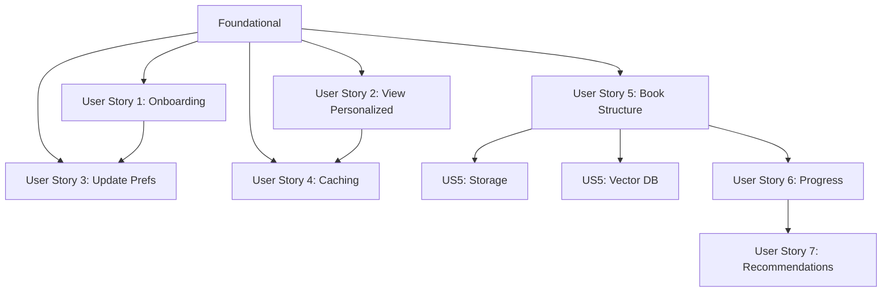

# Tasks: Content Personalization

**Input**: Design documents from `/specs/005-content-personalization/`
**Prerequisites**: plan.md (required), spec.md (required), research.md, data-model.md, contracts/api.yaml, quickstart.md

**Tests**: Tests are NOT explicitly requested - implementation tasks only.

**Organization**: Tasks are grouped by user story to enable independent implementation and testing.

## Format: `[ID] [P?] [Story] Description`

- **[P]**: Can run in parallel (different files, no dependencies)
- **[Story]**: Which user story this task belongs to (US1, US2, US3, US4)
- Include exact file paths in descriptions

## Path Conventions

- **Backend**: `packages/chatkit-backend/src/chatkit_backend/`
- **Frontend**: `apps/docs/src/`
- **Migrations**: `packages/chatkit-backend/alembic/`

---

## Phase 1: Setup (Shared Infrastructure)

**Purpose**: Project initialization and basic structure

- [x] T001 Add SQLAlchemy, asyncpg, alembic dependencies to packages/chatkit-backend/pyproject.toml
- [x] T002 [P] Create db/ directory structure in packages/chatkit-backend/src/chatkit_backend/db/
- [x] T003 [P] Create routers/ directory structure in packages/chatkit-backend/src/chatkit_backend/routers/
- [x] T004 [P] Add DATABASE_URL to packages/chatkit-backend/.env.example
- [x] T005 Initialize alembic with async configuration in packages/chatkit-backend/

---

## Phase 2: Foundational (Blocking Prerequisites)

**Purpose**: Core infrastructure that MUST be complete before ANY user story can be implemented

**⚠️ CRITICAL**: No user story work can begin until this phase is complete

- [x] T006 Create async database engine and session factory in packages/chatkit-backend/src/chatkit_backend/db/database.py
- [x] T007 Create Base SQLAlchemy model in packages/chatkit-backend/src/chatkit_backend/db/models.py
- [x] T008 Create User model (id, created_at, updated_at, onboarding_completed) in packages/chatkit-backend/src/chatkit_backend/db/models.py
- [x] T009 Configure alembic env.py for async SQLAlchemy in packages/chatkit-backend/alembic/env.py
- [x] T010 Create initial migration for users table in packages/chatkit-backend/alembic/versions/
- [x] T011 [P] Create UserContext provider with localStorage management in apps/docs/src/context/UserContext.tsx
- [x] T012 [P] Create db/__init__.py with exports in packages/chatkit-backend/src/chatkit_backend/db/__init__.py
- [x] T013 [P] Create routers/__init__.py in packages/chatkit-backend/src/chatkit_backend/routers/__init__.py
- [x] T014 Update Root.tsx to wrap app with UserContext provider in apps/docs/src/theme/Root.tsx

**Checkpoint**: Foundation ready - user story implementation can now begin

---

## Phase 3: User Story 1 - Complete Onboarding Questionnaire (Priority: P1) 🎯 MVP

**Goal**: First-time visitor completes 6-question onboarding questionnaire to personalize their learning experience

**Independent Test**: Visit site as new user → redirected to /onboarding → complete 6 questions → preferences saved → redirected to home

### Implementation for User Story 1

- [x] T015 [P] [US1] Create UserPreferences model in packages/chatkit-backend/src/chatkit_backend/db/models.py
- [x] T016 [US1] Create migration for user_preferences table in packages/chatkit-backend/alembic/versions/
- [x] T017 [P] [US1] Create Pydantic schemas for user and onboarding in packages/chatkit-backend/src/chatkit_backend/models/user.py
- [x] T018 [US1] Implement POST /api/user/create endpoint in packages/chatkit-backend/src/chatkit_backend/routers/user.py
- [x] T019 [US1] Implement GET /api/user/{user_id} endpoint in packages/chatkit-backend/src/chatkit_backend/routers/user.py
- [x] T020 [US1] Implement POST /api/onboarding endpoint in packages/chatkit-backend/src/chatkit_backend/routers/onboarding.py
- [x] T021 [US1] Include user and onboarding routers in packages/chatkit-backend/src/chatkit_backend/main.py
- [x] T022 [P] [US1] Create OnboardingQuestionnaire component (6 questions) in apps/docs/src/components/OnboardingQuestionnaire.tsx
- [x] T023 [US1] Create /onboarding page in apps/docs/src/pages/onboarding.tsx
- [x] T024 [US1] Add redirect logic for new users in UserContext (redirect to /onboarding if not onboarded)

**Checkpoint**: User Story 1 complete - new users can complete onboarding and have preferences stored

---

## Phase 4: User Story 2 - View Personalized Lesson Content (Priority: P1)

**Goal**: Onboarded user sees "Original | Personalized" tabs on lessons and can view content adapted to their profile

**Independent Test**: Complete onboarding → navigate to lesson → click "Personalized" tab → see adapted content

### Implementation for User Story 2

- [x] T025 [P] [US2] Create PersonalizedContentCache model in packages/chatkit-backend/src/chatkit_backend/db/models.py
- [x] T026 [US2] Create migration for personalized_content_cache table in packages/chatkit-backend/alembic/versions/
- [x] T027 [P] [US2] Create Pydantic schemas for personalization in packages/chatkit-backend/src/chatkit_backend/models/personalize.py
- [x] T028 [US2] Create personalization agent with adaptation prompt in packages/chatkit-backend/src/chatkit_backend/agents/personalizer.py
- [x] T029 [US2] Implement POST /api/personalize endpoint in packages/chatkit-backend/src/chatkit_backend/routers/personalize.py
- [x] T030 [US2] Include personalize router in packages/chatkit-backend/src/chatkit_backend/main.py
- [x] T031 [P] [US2] Create PersonalizedLesson component with tabs in apps/docs/src/components/PersonalizedLesson/index.tsx
- [x] T032 [P] [US2] Create PersonalizedContent component with fetch logic in apps/docs/src/components/PersonalizedLesson/PersonalizedContent.tsx
- [x] T033 [US2] Add PersonalizedLesson to MDXComponents in apps/docs/src/theme/MDXComponents.tsx
- [x] T034 [US2] Add loading and error states to PersonalizedContent component

**Checkpoint**: User Story 2 complete - users can view personalized content on lessons

---

## Phase 5: User Story 3 - Update Preferences (Priority: P2)

**Goal**: Returning user can update their learning preferences and see updated personalized content

**Independent Test**: Access profile settings → modify preferences → save → verify personalized content reflects changes

### Implementation for User Story 3

- [x] T035 [US3] Implement GET /api/user/preferences endpoint in packages/chatkit-backend/src/chatkit_backend/routers/onboarding.py
- [x] T036 [US3] Implement PUT /api/user/preferences endpoint in packages/chatkit-backend/src/chatkit_backend/routers/onboarding.py
- [x] T037 [US3] Implement DELETE /api/personalize/cache endpoint in packages/chatkit-backend/src/chatkit_backend/routers/personalize.py
- [x] T038 [P] [US3] Create PreferencesEditor component in apps/docs/src/components/PreferencesEditor.tsx
- [x] T039 [US3] Create /profile page with preferences editor in apps/docs/src/pages/profile.tsx
- [x] T040 [US3] Add cache invalidation call when preferences updated in PreferencesEditor

**Checkpoint**: User Story 3 complete - users can update preferences and receive fresh personalized content

---

## Phase 6: User Story 4 - Cached Personalization (Priority: P3)

**Goal**: Personalized content is cached and served instantly on revisits, invalidated when content or preferences change

**Independent Test**: Personalize a lesson → navigate away → return → verify instant load from cache

### Implementation for User Story 4

- [x] T041 [US4] Add content_hash computation to personalize endpoint in packages/chatkit-backend/src/chatkit_backend/routers/personalize.py
- [x] T042 [US4] Add preferences_hash computation to personalize endpoint in packages/chatkit-backend/src/chatkit_backend/routers/personalize.py
- [x] T043 [US4] Implement cache lookup before generation in personalize endpoint
- [x] T044 [US4] Add cache storage after successful generation
- [x] T045 [US4] Add 'cached' flag to PersonalizeResponse indicating cache hit/miss

**Checkpoint**: User Story 4 complete - personalized content is cached and served efficiently

---

## Phase 7: Polish & Cross-Cutting Concerns

**Purpose**: Improvements that affect multiple user stories

- [x] T046 [P] Add CSS styles for onboarding and personalized lesson components in apps/docs/src/css/personalization.css
- [x] T047 [P] Add navigation link to profile page in header
- [ ] T048 Run end-to-end test: new user → onboarding → personalized lesson → cache hit
- [ ] T049 Run quickstart.md validation with curl commands
- [ ] T050 Update constitution.md with personalization requirements if needed

---

## Phase 8: User Story 5 - Book Structure (Priority: P1)

**Goal**: Create hierarchical book structure tables and content API

**Independent Test**: GET /api/content/book → returns complete parts/chapters/lessons hierarchy

### Implementation for User Story 5 (Book Structure)

- [x] T051 [P] [US5] Create Book model in packages/chatkit-backend/src/chatkit_backend/db/models.py
- [x] T052 [P] [US5] Create Part model in packages/chatkit-backend/src/chatkit_backend/db/models.py
- [x] T053 [P] [US5] Create Chapter model in packages/chatkit-backend/src/chatkit_backend/db/models.py
- [x] T054 [P] [US5] Create Lesson model in packages/chatkit-backend/src/chatkit_backend/db/models.py
- [x] T055 [US5] Create migration 002_book_structure.py in packages/chatkit-backend/alembic/versions/
- [x] T056 [US5] Create seed migration 003_seed_book_data.py from curriculum.md
- [x] T057 [P] [US5] Create Pydantic schemas for content in packages/chatkit-backend/src/chatkit_backend/models/content.py
- [x] T058 [US5] Create content.py router with book browse endpoints in packages/chatkit-backend/src/chatkit_backend/routers/content.py
- [x] T059 [US5] Register content router in packages/chatkit-backend/src/chatkit_backend/main.py
- [ ] T060 [US5] Run migrations and verify book structure in database

**Checkpoint**: Book structure API returns complete hierarchy

---

## Phase 9: User Story 5 - Storage Integration (Priority: P1)

**Goal**: Upload content to MCP storage bucket and serve via API

**Independent Test**: GET /api/content/lessons/{slug}/content → returns markdown from bucket

### Implementation for User Story 5 (Storage)

- [ ] T061 [P] [US5] Create MCPStorageClient in packages/chatkit-backend/src/chatkit_backend/services/mcp_storage.py
- [ ] T062 [P] [US5] Create ContentSyncService in packages/chatkit-backend/src/chatkit_backend/services/content_sync.py
- [ ] T063 [US5] Add content_hash computation to ContentSyncService
- [ ] T064 [US5] Implement upload_lesson method in ContentSyncService
- [ ] T065 [US5] Create CLI command for content sync in packages/chatkit-backend/src/chatkit_backend/cli.py
- [ ] T066 [US5] Add GET /api/content/lessons/{slug}/content endpoint to content.py router
- [ ] T067 [US5] Run initial content sync to upload all lessons to bucket
- [ ] T068 [US5] Update lessons table with bucket_path and content_hash

**Checkpoint**: All lessons uploaded to storage bucket and retrievable via API

---

## Phase 10: User Story 5 - Vector DB Integration (Priority: P1)

**Goal**: Embed lesson content for RAG-enabled search

**Independent Test**: POST /api/search → returns relevant lesson chunks

### Implementation for User Story 5 (Vector DB)

- [ ] T069 [P] [US5] Create EmbeddingService with chunking in packages/chatkit-backend/src/chatkit_backend/services/embeddings.py
- [ ] T070 [P] [US5] Create MCPVectorClient in packages/chatkit-backend/src/chatkit_backend/services/mcp_vector.py
- [ ] T071 [US5] Add embed_lesson method to EmbeddingService
- [ ] T072 [US5] Integrate embedding generation into content sync workflow
- [ ] T073 [US5] Create search.py router with POST /api/search endpoint
- [ ] T074 [US5] Register search router in main.py
- [ ] T075 [US5] Update lessons table with vector_ids after embedding

**Checkpoint**: All lessons embedded in vector DB, semantic search working

---

## Phase 11: User Story 6 - Progress Tracking (Priority: P2)

**Goal**: Track user progress through lessons

**Independent Test**: POST /api/progress/lessons/{slug}/start → progress recorded

### Implementation for User Story 6

- [x] T076 [P] [US6] Create UserProgress model in packages/chatkit-backend/src/chatkit_backend/db/models.py
- [x] T077 [US6] Update User model with progress_entries relationship
- [x] T078 [US6] Create migration 004_user_progress.py (or include in 002)
- [x] T079 [P] [US6] Create Pydantic schemas for progress in packages/chatkit-backend/src/chatkit_backend/models/content.py
- [x] T080 [US6] Create progress.py router in packages/chatkit-backend/src/chatkit_backend/routers/progress.py
- [x] T081 [US6] Implement GET /api/progress (overall summary) endpoint
- [x] T082 [US6] Implement GET /api/progress/lessons/{slug} endpoint
- [x] T083 [US6] Implement POST /api/progress/lessons/{slug}/start endpoint
- [x] T084 [US6] Implement POST /api/progress/lessons/{slug}/complete endpoint
- [x] T085 [US6] Implement PUT /api/progress/lessons/{slug}/time endpoint
- [x] T086 [US6] Register progress router in main.py

**Checkpoint**: Progress tracking endpoints working, state transitions correct

---

## Phase 12: User Story 7 - Recommendations (Priority: P2)

**Goal**: Provide personalized lesson recommendations

**Independent Test**: GET /api/progress/recommendations → returns prioritized lessons

### Implementation for User Story 7

- [x] T087 [P] [US7] Create RecommendationService in packages/chatkit-backend/src/chatkit_backend/routers/progress.py (inline)
- [x] T088 [US7] Implement get_next_sequential_lessons method
- [x] T089 [US7] Implement check_prerequisites method
- [x] T090 [US7] Implement score_by_learning_goals method
- [x] T091 [US7] Implement layer_progression_filter method (L1→L2→L3)
- [x] T092 [US7] Implement GET /api/progress/recommendations endpoint
- [x] T093 [US7] Add recommendation reasons to response

**Checkpoint**: Recommendations respect prerequisites and align with user goals

---

## Phase 13: Integration Testing

**Purpose**: End-to-end testing of all new features

- [ ] T094 Test book structure API: GET /api/content/book returns all parts/chapters/lessons
- [ ] T095 Test content from bucket: GET /api/content/lessons/{slug}/content returns markdown
- [ ] T096 Test semantic search: POST /api/search returns relevant chunks
- [ ] T097 Test progress flow: start → time → complete → verify state
- [ ] T098 Test recommendations: verify prerequisites and goal alignment
- [ ] T099 Run full E2E: onboarding → browse → progress → recommendations

---

## Dependencies & Execution Order

### Phase Dependencies

- **Setup (Phase 1)**: No dependencies - can start immediately
- **Foundational (Phase 2)**: Depends on Setup completion - BLOCKS all user stories
- **User Stories (Phase 3-6)**: All depend on Foundational phase completion
  - US1 and US2 are both P1 priority but have no dependencies on each other
  - US3 (P2) can proceed after Foundational, integrates with US1/US2
  - US4 (P3) enhances US2 but can be developed in parallel
- **Polish (Phase 7)**: Depends on all user stories being complete
- **Book Structure (Phase 8)**: Depends on Phase 2 Foundational
- **Storage Integration (Phase 9)**: Depends on Phase 8 Book Structure
- **Vector DB (Phase 10)**: Depends on Phase 8, can run in parallel with Phase 9
- **Progress Tracking (Phase 11)**: Depends on Phase 8 Book Structure
- **Recommendations (Phase 12)**: Depends on Phase 11 Progress Tracking
- **Integration Testing (Phase 13)**: Depends on Phases 9, 10, 11, 12

### User Story Dependencies



- **User Story 1 (P1)**: Can start after Foundational - Foundation for user management
- **User Story 2 (P1)**: Can start after Foundational - Uses User model, independent of onboarding flow
- **User Story 3 (P2)**: Benefits from US1 (needs preferences to exist) but can be developed after Foundation
- **User Story 4 (P3)**: Enhances US2 (adds caching layer) but can be developed after Foundation
- **User Story 5 (P1)**: Book Structure - Creates tables, storage sync, vector embeddings
- **User Story 6 (P2)**: Progress Tracking - Depends on US5 (needs lessons table)
- **User Story 7 (P2)**: Recommendations - Depends on US6 (needs progress data)

### Within Each User Story

- Models before services/endpoints
- Backend endpoints before frontend components
- Core implementation before integration

### Parallel Opportunities

- Setup tasks T002, T003, T004 can run in parallel
- Foundational tasks T011, T012, T013 can run in parallel
- US1 tasks T015, T017, T022 can run in parallel (different files)
- US2 tasks T025, T027, T031, T032 can run in parallel (different files)
- US3 task T038 can run in parallel with backend tasks

---

## Parallel Example: User Story 1

```bash
# Launch these in parallel (different files):
Task: "Create UserPreferences model in packages/chatkit-backend/src/chatkit_backend/db/models.py"
Task: "Create Pydantic schemas for user and onboarding in packages/chatkit-backend/src/chatkit_backend/models/user.py"
Task: "Create OnboardingQuestionnaire component (6 questions) in apps/docs/src/components/OnboardingQuestionnaire.tsx"
```

---

## Parallel Example: User Story 2

```bash
# Launch these in parallel (different files):
Task: "Create PersonalizedContentCache model in packages/chatkit-backend/src/chatkit_backend/db/models.py"
Task: "Create Pydantic schemas for personalization in packages/chatkit-backend/src/chatkit_backend/models/personalize.py"
Task: "Create PersonalizedLesson component with tabs in apps/docs/src/components/PersonalizedLesson/index.tsx"
Task: "Create PersonalizedContent component with fetch logic in apps/docs/src/components/PersonalizedLesson/PersonalizedContent.tsx"
```

---

## Implementation Strategy

### MVP First (User Story 1 Only)

1. Complete Phase 1: Setup
2. Complete Phase 2: Foundational (CRITICAL - blocks all stories)
3. Complete Phase 3: User Story 1
4. **STOP and VALIDATE**: Test onboarding flow independently
5. Deploy/demo if ready - users can complete onboarding!

### MVP+ (User Stories 1 & 2)

1. Complete Setup + Foundational
2. Complete User Story 1 → Test independently
3. Complete User Story 2 → Test independently
4. **STOP and VALIDATE**: New users can onboard AND view personalized content
5. This is a strong MVP demonstrating core value proposition

### Incremental Delivery

1. MVP+ (US1 + US2) → Deploy
2. Add User Story 3 → Users can update preferences → Deploy
3. Add User Story 4 → Performance optimization → Deploy
4. Each increment adds value without breaking previous functionality

### Parallel Team Strategy

With multiple developers:

1. Team completes Setup + Foundational together
2. Once Foundational is done:
   - Developer A: User Story 1 (onboarding)
   - Developer B: User Story 2 (personalization UI)
3. After US1 complete:
   - Developer A: User Story 3 (update preferences)
4. After US2 complete:
   - Developer B: User Story 4 (caching)
5. Stories complete and integrate independently

---

## Summary

| Metric | Value |
|--------|-------|
| Total Tasks | 99 |
| Completed Tasks | 78 |
| Remaining Tasks | 21 |
| Setup Tasks | 5 (T001-T005) ✅ |
| Foundational Tasks | 9 (T006-T014) ✅ |
| User Story 1 Tasks | 10 (T015-T024) ✅ |
| User Story 2 Tasks | 10 (T025-T034) ✅ |
| User Story 3 Tasks | 6 (T035-T040) ✅ |
| User Story 4 Tasks | 5 (T041-T045) ✅ |
| Polish Tasks | 5 (T046-T050) - 2 done, 3 pending |
| User Story 5 Tasks (Book Structure) | 10 (T051-T060) - 9 done, 1 pending |
| User Story 5 Tasks (Storage) | 8 (T061-T068) - pending |
| User Story 5 Tasks (Vector DB) | 7 (T069-T075) - pending |
| User Story 6 Tasks (Progress) | 11 (T076-T086) ✅ |
| User Story 7 Tasks (Recommendations) | 7 (T087-T093) ✅ |
| Integration Testing Tasks | 6 (T094-T099) - pending |
| Parallelizable [P] | 30+ tasks |
| MVP Scope | US1 + US2 + US5 (Book Structure) |

---

## Notes

- [P] tasks = different files, no dependencies
- [Story] label maps task to specific user story for traceability
- Each user story should be independently completable and testable
- Commit after each task or logical group
- Stop at any checkpoint to validate story independently
- Backend tasks should be completed before corresponding frontend tasks within each story
- MCP servers (storage:8001, vectordal:8002) must be running for Phases 9-10
- Seed data from `.specify/memory/curriculum.md` for Phase 8
